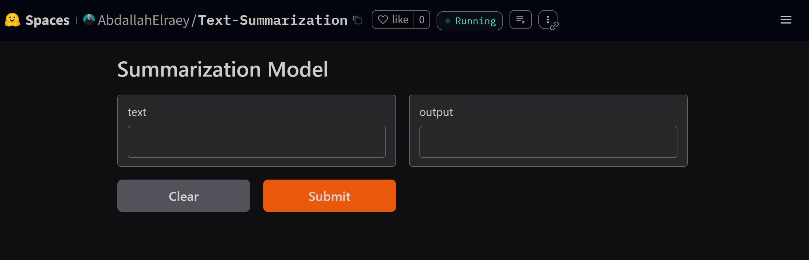

# **Natural Language End-To-End Summarization App**

This is a full-featured summarization pipeline that processes "TED Talk" transcripts or any of your choice into concise summaries using state-of-the-art NLP models. The app is designed with a modular architecture and supports multiple interfaces, including a UI, API, and CLI, for maximum flexibility and usability. It leverages Hugging Face Transformers, FastAPI, MongoDB Atlas, Docker and others for seamless deployment and scalability.

---

## **Features**

- **Complete NLP Pipeline:** From data ingestion to model fine-tuning and inference, the pipeline handles:
  - Data ingestion, standardization, validation, and transformation.
  - Remote data management using MongoDB Atlas.
  - Modular design for reusability and scalability.
- **Model Integration:**
  - Hugging Face Transformers for model fine-tuning, validation and inferance.
  - Uploading fine-tuned model to Hugging Face model hub that could be then easliy deployed via spaces.
  - TED Talks dataset for training and evaluation.
- **Logging and Outputs:**
  - Detailed logging at every stage for transparency.
  - All outputs (e.g., standardized data, models, and artifacts) saved in the `artifacts` folder.
- **Interfaces:**
  - **UI**: Built with Gradio or Mesop.
  - **API**: Developed using FastAPI for remote access.
  - **CLI**: Trigger complete pipelines with a single command.
- **Cloud and Local Deployment:**
  - Hugging Face Model Hub for hosting and inference.
  - Fully functinoal reproducable configured local enviroment.
  - Dockerized setup for reproducibility and platform independence.
- **Configuration Management:**
  - `.env` file for environment variables.
  - `config.yml` for tailored configuration.
  - `params.yaml` for model and pipeline configuration.

---
## **Project Directory Structure**

```plaintext
TEXT SUMMARIZATION/
├── __pycache__/
├── .github/                     # GitHub workflows and configurations.
├── artifacts/                   # Stores outputs like standardized data and trained models.
├── assets/                      # Images and documentation-related assets.
├── config/                      # Configuration files for pipeline stages and model parameters.
├── logs/                        # Log files for monitoring and debugging.
├── poc/                         # Proof-of-concept notebooks for experimentation.
├── src/                         # Main application source code.
│   ├── TextSummarizer/
│       ├── components/          # Individual modules for each stage in the pipeline.
│       ├── config/              # Configuration manager and related utilities.
│       ├── constants/           # Constant values used across the app.
│       ├── entity/              # Data classes for structured objects.
│       ├── logging/             # Custom logging setup.
│       ├── pipeline/            # Orchestrates the execution of pipeline stages.
│       ├── routes/              # API routes for FastAPI.
│       ├── utils/               # Utility functions.
│       ├── viewers/             # Code for UI viewers like Gradio or Mesop.
│       └── __init__.py          # Package initializer.
├── textsummarizer-env/          # Virtual environment directory.
├── .dockerignore                # Ignore patterns for Docker builds.
├── .env                         # Environment variables.
├── .env.example                 # Example environment file.
├── .gitignore                   # Git ignore patterns.
├── app.py                       # Application entry point.
├── deployment_requirements.txt  # Additional requirements for deployment.
├── Dockerfile                   # Docker configuration for containerization.
├── LICENSE                      # License information (MIT).
├── main.py                      # Main pipeline execution script.
├── params.yaml                  # YAML configuration for model fine-tuning.
├── ProjectTemplate.py           # Project template for consistency.
├── README.md                    # Project documentation.
├── requirements.txt             # Required Python packages.
└── setup.py                     # Setup script for reproducibility.
```

---

## **Technologies Used**

- **Python 3.11.0**: Core programming language.
- **Hugging Face Transformers**: Model fine-tuning and deployment.
- **FastAPI**: API development.
- **Gradio** and **Streamlit**: UI components.
- **MongoDB Atlas**: Remote data management.
- **Docker**: Containerized deployment.
- **Logging Module**: Pipeline logging.
- **PyYAML**: Configuration management.
- And many others in the `requirements.txt` file.

---

## **Setup and Installation**

1. **Clone the Repository:**
   ```bash
   git clone https://github.com/Abdallahelraey/Text-Summarization.git
   ```

2. **Set Up a Virtual Environment:**
   ```bash
   python3 -m venv venv
   venv\Scripts\activate
   ```

3. **Install Dependencies:**
   ```bash
   pip install -r requirements.txt
   ```

4. **Configure Environment:**
   - Update the `.env` file with your environment variables (e.g., MongoDB URI, API keys).
   - Update `params.yaml` for model configurations and data URIs.
   - Update `config.yml` for tailored configuration.

5. **Run the App Locally:**
**When it comes to running the app you can chose one of three options via an argument that you can pass with the cli running command...**
    a. If you want to use `API's` you can use:
    ```bash
    python app.py api
    ```

    b. If you want to use `MesopUI` you can use:
    ```bash
    python app.py mesop
    ```

    c. If you want to use `GradioUI` you can use:
    ```bash
    python app.py gradio
    ```


6. **Run the model on the cloud via Huggin Face Spaces**


7. **Docker Setup (Optional):**
   ```bash
   docker build -t summarization-app .
   docker run -p 8000:8000 summarization-app # Or any port of your choise
   ```

---

## **Customization**

- **Fine-Tune Your Model:** Change the model name in `params.yaml` and provide a new dataset URI to train on your data.  
- **Add Your Dataset:** Update the `params.yaml` configuration to specify a new data source.  

---

## **Examples**

1. Summarizing a TED Talk:
   - Upload a transcript file via the UI or API.
   - Receive a concise summary output.
2. Re-train the model on a custom dataset:
   - Update the configuration files and trigger the pipeline.

---

## **Deployment Options**

- **Local:** Full pipeline execution, including downloading, fine-tuning, and inference.  
- **Cloud:** Model hosted on Hugging Face Model Hub, accessible via UI, API, or CLI.  
- **Docker:** Portable deployment using Docker containers.  

---

## **Future Enhancements**

- Full deployment to Amazon Cloud.  
- Implementing CI/CD pipelines.  
- Adding model and data versioning for better DevOps integration.  

---

## **Contributions and Support**

We welcome contributions!  

---

## **License**

This project is licensed under the MIT License.  
